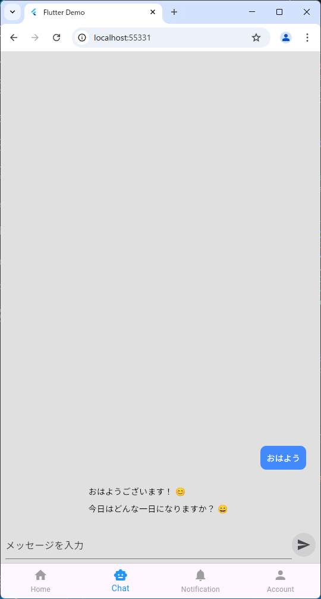

# chatbotapp

DifyおよびDIFY_BFF(https://github.com/MichitoIchimaru/dify_bff)を起動した状態で本ツールを実行すると、DifyをAPIで呼び出した状態でチャットができるようになります。

## ライセンス
本ソフトウェアはライセンスを定めておりません。許可なく利用、修正、複製、配布することを禁止します。

# 使い方

## .env
assetsフォルダに.envファイルを作成してください

| 項目 | 値 |
|:--|:--|
|BFF_URL|DIFY_BFFのURL|

例）
```
BFF_URL = "http://192.168.xxx.xxx:3000/api/v1/chat-messages"
```
## 起動

```
flutter pub get
flutter run
※chromeを選択
```
androidフォルダでエラーが出る場合はandroidフォルダで下記を実施
```
gradle wrapper
```

